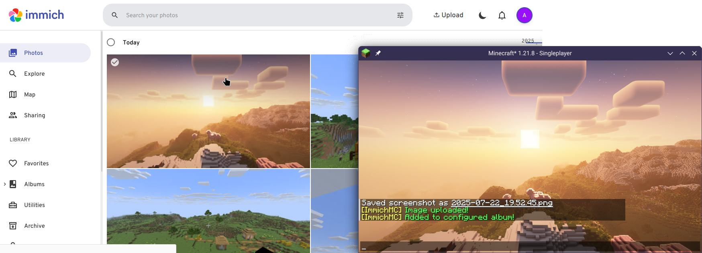

# ImmichMC
A client-side mod that automatically uploads your screenshot to an [Immich](https://immich.app/) instance of your choice, with option for auto-assigning to a specified album.

Works on Minecraft Fabric 1.21.1/1.21.8.

## Prerequisite 
1. You need to have an Immich instance with an account that you can access.
2. You need to generate an API Key under your account, please visit [here](https://immich.app/docs/features/command-line-interface/#obtain-the-api-key) for instruction.

## Configuring
[Mod Menu](https://modrinth.com/mod/modmenu) is required for configuration.

1. Open the mod menu screen, find ImmichMC and click on the configure button.
2. Fill the instance API URL (Remember the url should end with `/api`!)
3. Fill in the API Key
4. Done! Use F2 to capture a Minecraft Screenshot, and it will automatically be uploaded to the instance!

## License
This project is licensed under the [MIT License](./LICENSE)